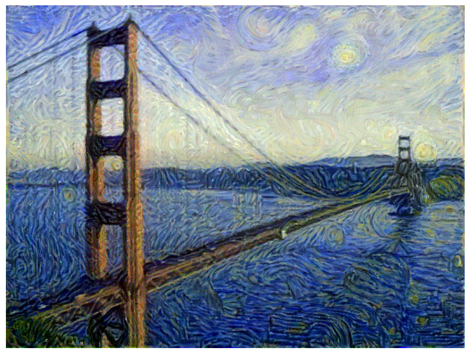
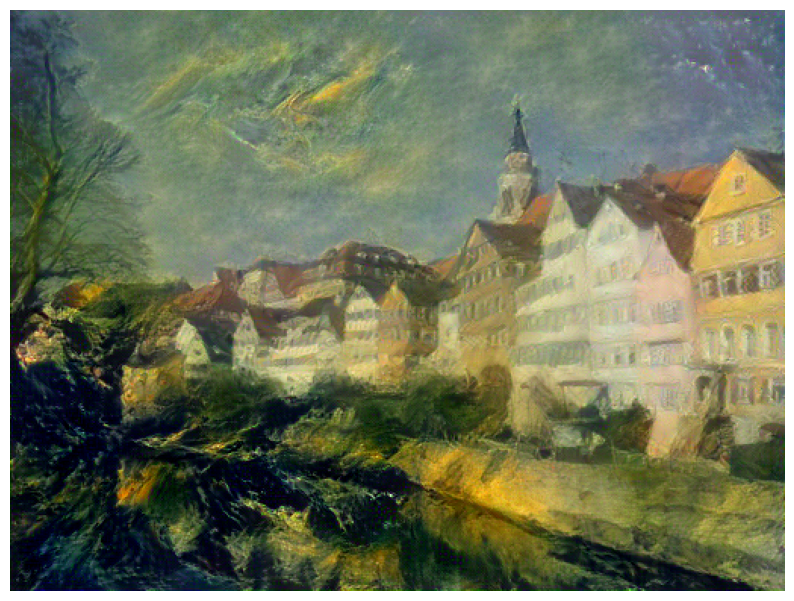
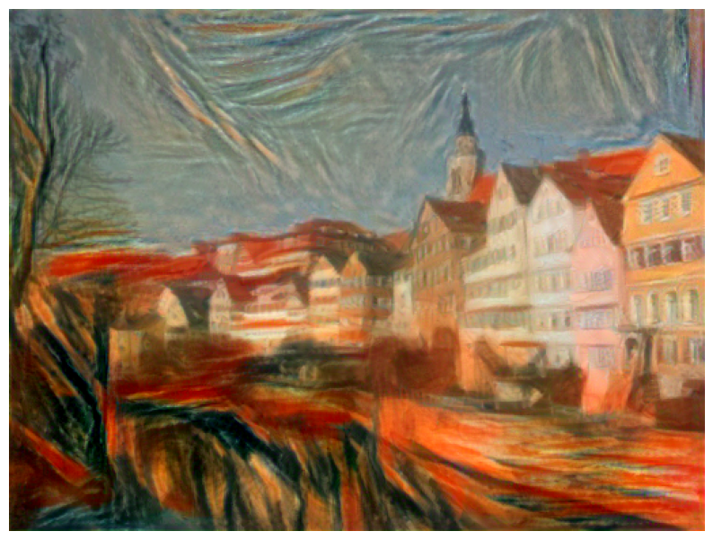
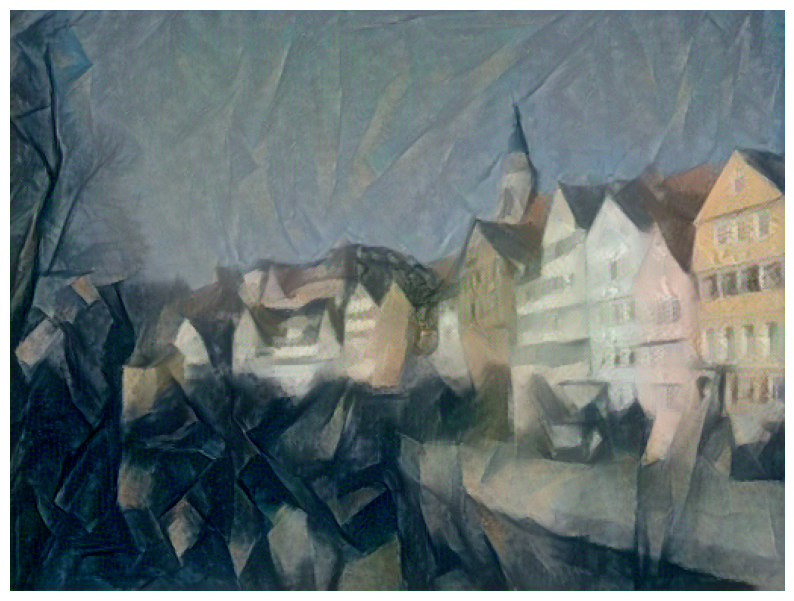
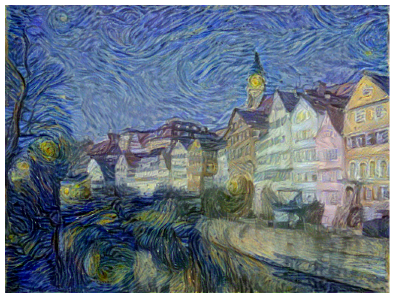
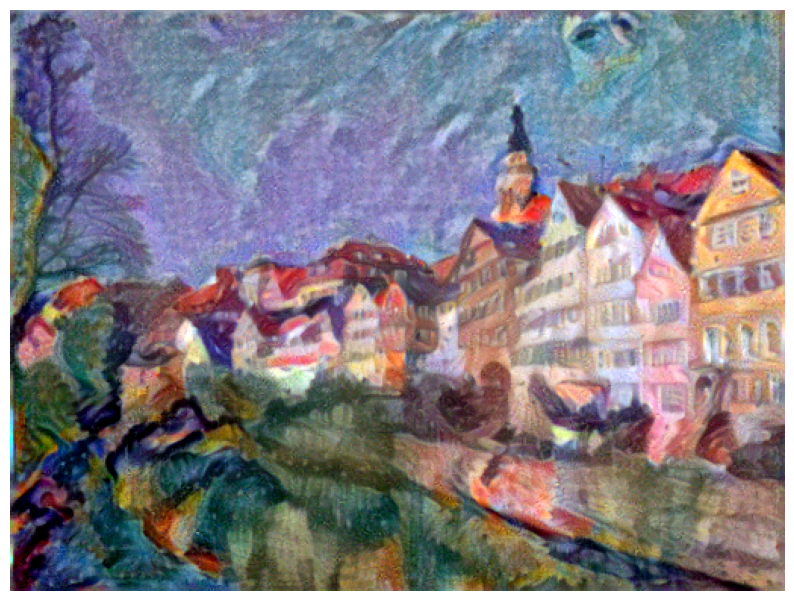
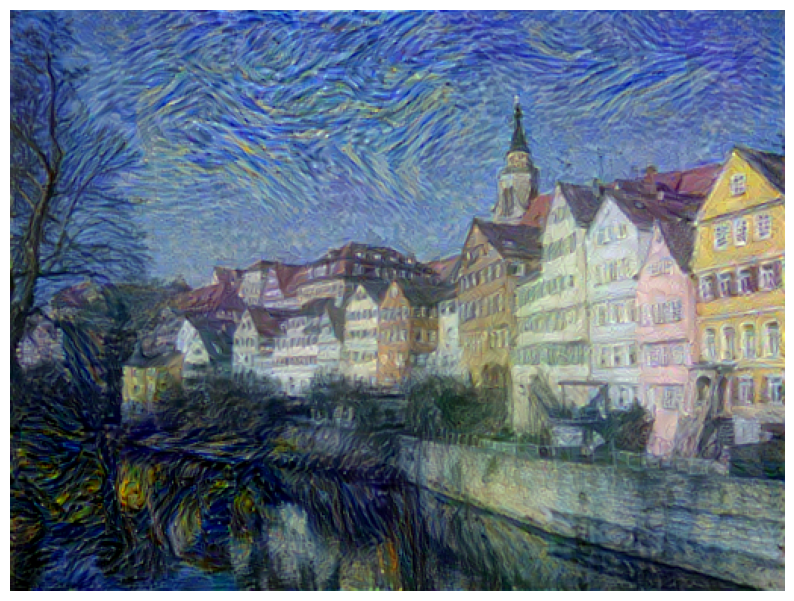
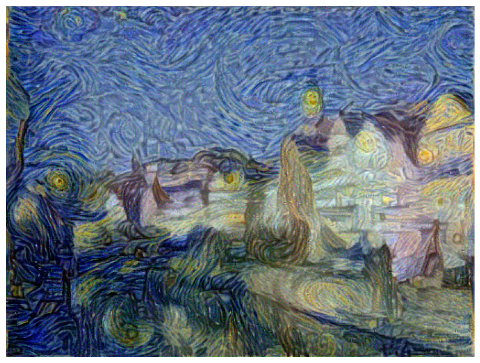

# Neural Style Transfer

An implementation of neural style transfer algorithm using Jittor framework, reproducing the seminal work "Image Style Transfer Using Convolutional Neural Networks" by Leon A. Gatys, Alexander S. Ecker, and Matthias Bethge.

## Project Overview

This project utilizes convolutional neural networks (CNN) to transfer artistic styles from style images to content images, generating novel images that combine the structural content of one image with the artistic style of another. The algorithm synthesizes images in the feature space of VGG network by optimizing content and style loss functions.

And here is an example of mixing Golden Gate Bridge and The Starry Night.

### Tübingen University Building Style Transfer Series

  

   

## Style Weight Adjustment

The intensity of style transfer can be controlled by adjusting the style loss weight coefficient, enabling different levels of artistic effects. From left to right, the ratio `content_weight` / `style_weight` is 1e-6, 1e-7, 1e-9

##  Technical Specifications

- **Framework**: Jittor
- **Base Network**: VGG-16
- **Content Layer**: relu4_2
- **Style Layers**: relu1_1, relu2_1, relu3_1, relu4_1, relu5_1
- **Optimizer**: Adam
- **Loss Function**: Content Loss + Style Loss + Tv Loss

## Usage
For detailed implementation and step-by-step instructions, please follow the Jupyter notebook:

## Reference 
Gatys, L. A., Ecker, A. S., & Bethge, M. (2016). Image Style Transfer Using Convolutional Neural Networks. Proceedings of the IEEE Conference on Computer Vision and Pattern Recognition (CVPR).

